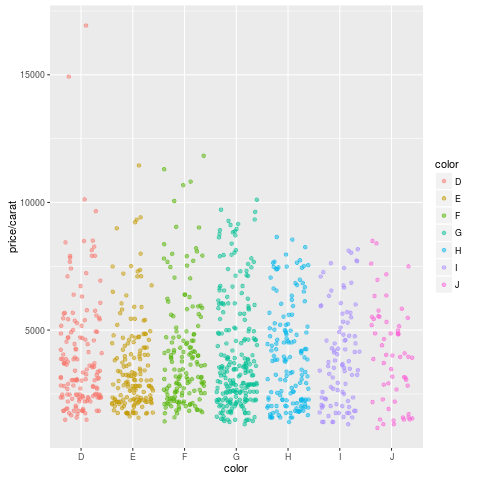

<!---
- Compile from command-line
Rscript -e "rmarkdown::render('sample.Rmd', output_format=c('pdf_document', 'html_document'), clean=FALSE)"; Rscript -e "rmarkdown::knit('sample.Rmd', tangle=TRUE)"

- Commit to github
git commit -am "some edits"; git push -u origin master

- To customize font size and other style features, add this line to output section in preamble:  
    css: style.css
-->

# Resources 

+ [Slides]()
+ [This HTML Vignette on GitHub](https://goo.gl/8KqnVm)
+ [GitHub Repository](https://github.com/tgirke/reproducible)

# R Markdown

## Overview

R Markdown combines markdown (an easy to write plain text format) with embedded
R code chunks. When compiling R Markdown documents, the code components can be
evaluated so that both the code and its output can be included in the final
document. This makes analysis reports highly reproducible by allowing to automatically
regenerate them when the underlying R code or data changes. R Markdown
documents (`.Rmd` files) can be rendered to various formats including HTML and
PDF. The R code in an `.Rmd` document is processed by `knitr`, while the
resulting `.md` file is rendered by `pandoc` to the final output formats
(_e.g._ HTML or PDF). Historically, R Markdown is an extension of the older
`Sweave/Latex` environment. Rendering of mathematical expressions and reference
management is also supported by R Markdown using embedded Latex syntax and
Bibtex, respectively.

## Quick Start

### Install R Markdown

```{r install_rmarkdown, eval=FALSE}
install.packages("rmarkdown")
```

### New R Markdown script

To minimize typing, it can be helful to start with an R Markdown template and
then modify it as needed. Note the file name of an R Markdown scirpt needs to
have the extension `.Rmd`. Template files for the following examples are available 
here:

+ R Markdown sample script: [`sample.Rmd`](https://raw.githubusercontent.com/tgirke/GEN242/master/vignettes/07_Rbasics/sample.Rmd)
+ Bibtex file for handling citations and reference section: [`bibtex.bib`](https://raw.githubusercontent.com/tgirke/GEN242/master/vignettes/07_Rbasics/bibtex.bib)

Users want to download these files, open the `sample.Rmd` file with their preferred R IDE 
(_e.g._ RStudio, vim or emacs), initilize an R session and then direct their R session to 
the location of these two files.


### Metadata section

The metadata section (YAML header) in an R Markdown script defines how it will be processed and 
rendered. The metadata section also includes both title, author, and date information as well as 
options for customizing the output format. For instance, PDF and HTML output can be defined 
with `pdf_document` and `html_document`, respectively. The `BiocStyle::` prefix will use the
formatting style of the [`BiocStyle`](http://bioconductor.org/packages/release/bioc/html/BiocStyle.html) 
package from Bioconductor.

```
 ---
title: "My First R Markdown Document"
author: "Author: First Last"
date: "Last update: `r format(Sys.time(), '%d %B, %Y')`"
output:
  BiocStyle::html_document:
    toc: true
    toc_depth: 3
    fig_caption: yes

fontsize: 14pt
bibliography: bibtex.bib
 ---
```

## Render `Rmd` script

An R Markdown script can be evaluated and rendered with the following `render` command or by pressing the `knit` button in RStudio.
The `output_format` argument defines the format of the output (_e.g._ `html_document`). The setting `output_format="all"` will generate 
all supported output formats. Alternatively, one can specify several output formats in the metadata section as shown in the above example.

```{r render_rmarkdown, eval=FALSE, message=FALSE}
rmarkdown::render("sample.Rmd", clean=TRUE, output_format="html_document")

```

The following shows how to render both PDF and HTML formatted files from the command-line, and also generate the corresponding `.R` file.

```{sh render_commandline, eval=FALSE, message=FALSE}
$ Rscript -e "rmarkdown::render('sample.Rmd', output_format=c('pdf_document', 'html_document'), clean=FALSE)"
$ Rscript -e "knitr::knit('sample.Rmd', tangle=TRUE)"  
```

Alternatively, one can use a Makefile to evaluate and render an R Markdown
script. A sample Makefile for rendering the above `sample.Rmd` can be
downloaded [`here`](https://raw.githubusercontent.com/tgirke/GEN242/master/vignettes/07_Rbasics/Makefile).
To apply it to a custom `Rmd` file, one needs open the Makefile in a text
editor and change the value assigned to `MAIN` (line 13) to the base name of
the corresponding `.Rmd` file (_e.g._ assign `sample` if the file
name is `sample.Rmd`).  To execute the `Makefile`, run the following
command from the command-line.

```{sh render_makefile, eval=FALSE, message=FALSE}
$ make -B
```

## R code chunks

R Code Chunks can be embedded in an R Markdown script by using three backticks
at the beginning of a new line along with arguments enclosed in curly braces
controlling the behavior of the code. The following lines contain the
plain R code. A code chunk is terminated by a new line starting with three backticks.
The following shows an example of such a code chunk. Note the backslashes are
not part of it. They have been added to print the code chunk syntax in this document.

```
	```\{r code_chunk_name, eval=FALSE\}
	x <- 1:10
	```
```

The following lists the most important arguments to control the behavior of R code chunks:

+ `r`: specifies language for code chunk, here R
+ `chode_chunk_name`: name of code chunk; this name needs to be unique
+ `eval`: if assigned `TRUE` the code will be evaluated
+ `warning`: if assigned `FALSE` warnings will not be shown
+ `message`: if assigned `FALSE` messages will not be shown
+ `cache`: if assigned `TRUE` results will be cached to reuse in future rendering instances
+ `fig.height`: allows to specify height of figures in inches
+ `fig.width`: allows to specify width of figures in inches

For more details on code chunk options see [here](https://www.rstudio.com/wp-content/uploads/2015/03/rmarkdown-reference.pdf).


## Learning Markdown

The basic syntax of Markdown and derivatives like kramdown is extremely easy to learn. Rather
than providing another introduction on this topic, here are some useful sites for learning Markdown:

+ [Markdown Intro on GitHub](https://guides.github.com/features/mastering-markdown/)
+ [Markdown Cheet Sheet](https://github.com/adam-p/markdown-here/wiki/Markdown-Cheatsheet)
+ [Markdown Basics from RStudio](http://rmarkdown.rstudio.com/authoring_basics.html) 
+ [R Markdown Cheat Sheet](http://www.rstudio.com/wp-content/uploads/2015/02/rmarkdown-cheatsheet.pdf)
+ [kramdown Syntax](http://kramdown.gettalong.org/syntax.html)

## Tables

There are several ways to render tables. First, they can be printed within the R code chunks. Second, 
much nicer formatted tables can be generated with the functions `kable`, `pander` or `xtable`. The following
example uses `kable` from the `knitr` package.

```{r kable}
library(knitr)
kable(iris[1:12,])
```

## Figures

Plots generated by the R code chunks in an R Markdown document can be automatically 
inserted in the output file. The size of the figure can be controlled with the `fig.height`
and `fig.width` arguments.

```{r some_jitter_plot, eval=TRUE}
library(ggplot2)
dsmall <- diamonds[sample(nrow(diamonds), 1000), ]
ggplot(dsmall, aes(color, price/carat)) + geom_jitter(alpha = I(1 / 2), aes(color=color))
```

Sometimes it can be useful to explicitly write an image to a file and then insert that 
image into the final document by referencing its file name in the R Markdown source. For 
instance, this can be useful for time consuming analyses. The following code will generate a 
file named `myplot.png`. To insert the file  in the final document, one can use standard 
Markdown or HTML syntax, _e.g._: ``.  

```{r some_custom_inserted_plot, eval=TRUE, warning=FALSE, message=FALSE}
png("myplot.png")
ggplot(dsmall, aes(color, price/carat)) + geom_jitter(alpha = I(1 / 2), aes(color=color))
dev.off()
```
<center></center>

## Inline R code

To evaluate R code inline, one can enclose an R expression with a single back-tick
followed by `r` and then the actual expression.  For instance, the back-ticked version 
of 'r 1 + 1' evaluates to `r 1 + 1` and 'r pi' evaluates to `r pi`.

## Mathematical equations

To render mathematical equations, one can use standard Latex syntax. When expressions are 
enclosed with single `$` signs then they will be shown inline, while 
enclosing them with double `$$` signs will show them in display mode. For instance, the following 
Latex syntax `d(X,Y) = \sqrt[]{ \sum_{i=1}^{n}{(x_{i}-y_{i})^2} }` renders in display mode as follows:

$$d(X,Y) = \sqrt[]{ \sum_{i=1}^{n}{(x_{i}-y_{i})^2} }$$

## Citations and bibliographies

Citations and bibliographies can be autogenerated in R Markdown in a similar
way as in Latex/Bibtex. Reference collections should be stored in a separate
file in Bibtex or other supported formats. To cite a publication in an R Markdown 
script, one uses the syntax `[@<id1>]` where `<id1>` needs to be replaced with a 
reference identifier present in the Bibtex database listed in the metadata section 
of the R Markdown script  (_e.g._ `bibtex.bib`). For instance, to cite Lawrence et al. 
(2013), one  uses its reference identifier (_e.g._ `Lawrence2013-kt`) as `<id1>` [@Lawrence2013-kt]. 
This will place the citation inline in the text and add the corresponding
reference to a reference list at the end of the output document. For the latter a 
special section called `References` needs to be specified at the end of the R Markdown script.
To fine control the formatting of citations and reference lists, users want to consult this 
the corresponding [R Markdown page](http://rmarkdown.rstudio.com/authoring_bibliographies_and_citations.html).
Also, for general reference management and outputting references in Bibtex format [Paperpile](https://paperpile.com/features) 
can be very helpful.

# Building R Packages

## Short Overview 

R packages can be built with the `package.skeleton` function. The given example will create a directory named `mypackage` containing the skeleton of the package for all functions, methods and classes defined in the R script(s) passed on to the `code_files` argument. The basic structure of the package directory is described [here](http://manuals.bioinformatics.ucr.edu/home/programming-in-r#Progr_pack). The package directory will also contain a file named `Read-and-delete-me` with instructions for completing the package:

```{r package_skeleton1, eval=FALSE}
package.skeleton(name="mypackage", code_files=c("script1.R", "script2.R"))
```

Once a package skeleton is available one can build the package from the command-line (Linux/OS X). This will create a tarball of the package with its version number encoded in the file name. Subequently, the package tarball needs to be checked for errors with:

```{r r_build_package, eval=FALSE}
$ R CMD build mypackage
$ R CMD check mypackage_1.0.tar.gz
```

Install package from source
```{r install_package, eval=FALSE}
install.packages("mypackage_1.0.tar.gz", repos=NULL) 
```

For more details see [here](http://manuals.bioinformatics.ucr.edu/home/programming-in-r#TOC-Building-R-Packages)

## Exercise 

__Step 1__: Save one or more of your functions to a file called `script.R` and build the package with the `package.skeleton` function.

```{r package_skeleton2, eval=FALSE}
package.skeleton(name="mypackage", code_files=c("script1.R"), namespace=TRUE)
```

__Step 2__: Build tarball of the package

```{r build_package_tar, eval=FALSE}
system("R CMD build mypackage")
```

__Step 3__: Install and use package

```{r install_package_tar, eval=FALSE}
install.packages("mypackage_1.0.tar.gz", repos=NULL, type="source")
library(mypackage)
?myMAcomp # Opens help for function defined by mypackage
```

# GitHub

## What are Git and GitHub?

+ GitHub provides an unlimited number of free public repositories to each user. Via GitHub Education students can sign up for free private GitHub accounts (see [here](https://education.github.com)).
+ Git is a distributed version control system similar to SVN
+ GitHub is an online social coding service based on Git 
+ Combined Git/GitHub: environment for version control and social coding

## Installing Git
+ [Install](http://git-scm.com/book/en/Getting-Started-Installing-Git) on Windows, OS X and Linux
+ When using it from RStudio, it needs to find the Git executable

## Git Basics from Command-Line

+ Finding help from command-line 

```{sh git_syntax1, eval=FALSE}
$ git <command> --help
```

+ Initialize a directory as a Git repository

```{sh git_syntax2, eval=FALSE}
$ git init
```
	
+ Add files to Git repository (staging area) 

```{sh git_syntax3, eval=FALSE}
$ git add myfile
```

After editing file(s) in your repos, record a snapshot of the staging area 

```{sh git_syntax4, eval=FALSE}
$ git commit -am "some edits"
```

## GitHub Basics from Command-Line

+ Generate a new remote repository. Alternatively, create the repository online on the GitHub site.

```{sh git_syntax5, eval=FALSE}
$ git remote add origin https://github.com/tgirke/myrepos.git
```

+ Push updates to remote. Next time one can just use `git push`

```{sh git_syntax6, eval=FALSE}
$ git push -u origin master
```

+ Clone existing remote repository
    
```{sh git_syntax7, eval=FALSE}
$ git clone git@github.com:<user_name>/<repos_name>.git
```

+ Before working on project, update local git repos 

```{sh git_syntax8, eval=FALSE}
$ git pull 
```

+ Make changes and recommit local to remote 

```{sh git_syntax9, eval=FALSE}
git commit -am "some edits"; git push -u origin master
```


## Using GitHub from RStudio
+ After installing Git, set path to Git executable in Rstudio: 
	+ Tools `>` Global Options `>` Git/SVN

+ If needed, login to GitHub account and create repository. Use option `Initialize this repository with a README`. 

+ Clone repository by copying & pasting URL from repository into RStudio's 'Clone Git Repository' window: 
    + File `>` New Project `>` Version Control `>` Git `>` Provide URL

+ Now do some work (_e.g._ add an R script), commit and push changes as follows: 
    + Tools `>` Version Control `>` Commit

+ Check files in staging area and press `Commit Button`

+ To commit changes to GitHub, press `Push Button`

+ Shortcuts to automate above routines are [here](https://support.rstudio.com/hc/en-us/articles/200711853-Keyboard-Shortcuts)

+ To resolve password issues, follow instructions [here](https://github.com/jennybc/stat540_2014/blob/master/seminars/seminar92_git.md). 

# `BiocParallel`

+ Reduces complexity of parallel evaluations of R and non-R software on multicore systems and computer clusters
+ Achieved by unifying interface to existing parallel infrastructure availalbe for R such as `snow`, `foreach`, `multicore`, `parallel`, `BatchJobs`, etc.
+ Simplifies submission to clusters with schulers via template files
+ Eliminates need of bash submission files

## Parallelization on single machine with multiple cores

```{r bioparallel_singlemachine, eval=FALSE}
library(BiocParallel)
df <- iris[,1:4]
f <- function(x) rowMeans(df[x,])
bplist <- bplapply(seq(along=df[,1]), f, BPPARAM = MulticoreParam(workers=2))
bplist(unlist)
```

## Parallelization on computer cluster with scheduler

The following submits a simple custom function to a computer cluster using Torque as scheduler. The template files [.BatchJobs.R](https://raw.githubusercontent.com/tgirke/systemPipeR/master/inst/extdata/.BatchJobs.R) and [torque.tmpl](https://raw.githubusercontent.com/tgirke/systemPipeR/master/inst/extdata/torque.tmpl) have to be in the
same directory as the corresponding R session. Also note, the R function (here `f`) needs to define all resurces required to run its code including all input data and R 
packages, etc.

```{r bioparallel_cluster, eval=FALSE}
library(BiocParallel); library(BatchJobs)
df <- iris[1:20,1:4st(bplist)]
f <- function(x) {
    df <- iris[1:20,1:4]
    rowMeans(df[x,])
}
funs <- makeClusterFunctionsTorque("torque.tmpl")
param <- BatchJobsParam(length(df[,1]), resources=list(walltime="20:00:00", nodes="1:ppn=1", memory="6gb"), cluster.functions=funs)
register(param)
bplist <- bplapply(seq_along(df[,1]), f)
```

# Session Info

```{r sessionInfo}
sessionInfo()
```

# References

